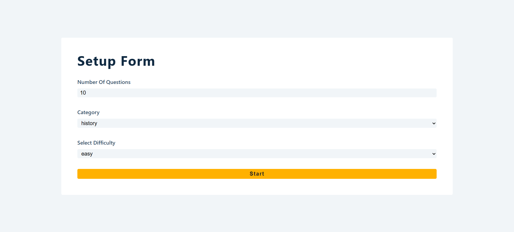
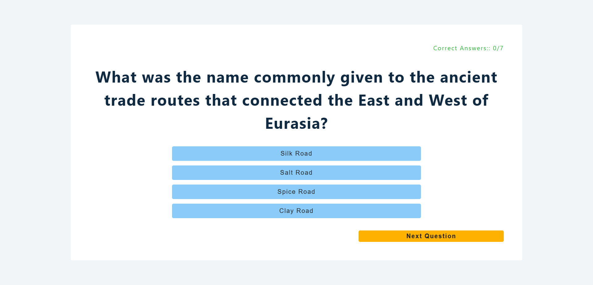
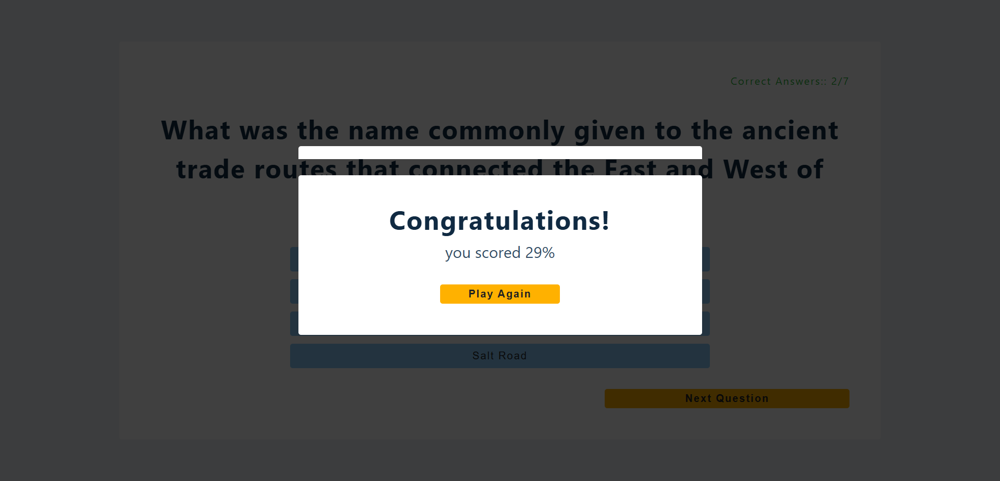

# Quiz React App

A dynamic and interactive Quiz application built with React, leveraging the Open TDB API to provide a wide range of questions across various categories and difficulty levels.

## Features

- **Customizable Quizzes**: Choose from different categories (Sports, History, Politics) and difficulty levels (Easy, Medium, Hard).
- **Infinite Questions**: Fetches real-time data from the Open Trivia Database (OpenTDB).
- **Responsive UI**: Clean and intuitive interface designed for all devices.
- **Real-time Scoring**: Track your progress as you answer questions.
- **Interactive Results**: View your final score in a polished modal at the end of each session.

## Screenshots

| Setup Form | Quiz Question | Result Modal |
| :---: | :---: | :---: |
|  |  |  |

## Tech Stack

- **Frontend**: React (Hooks, Context API)
- **Data Fetching**: Axios
- **API**: [OpenTDB](https://opentdb.com/api_config.php)
- **Icons**: React Icons / Font Awesome
- **Styling**: Vanilla CSS

## Getting Started

### Prerequisites

- Node.js (v14 or higher)
- npm or yarn

### Installation

1. Clone the repository:

   ```bash
   git clone https://github.com/aadhar-gaur/quiz-react-app.git
   ```

2. Navigate to the project directory:

   ```bash
   cd quiz-react-app
   ```

3. Install dependencies:

   ```bash
   npm install
   ```

4. Start the development server:

   ```bash
   npm start
   ```

## Folder Structure

```text
quiz/
├── public/
│   ├── screens/         # Project screenshots
│   └── index.html
├── src/
│   ├── App.js           # Main component & routing logic
│   ├── context.js       # Global state management (Context API)
│   ├── SetupForm.js     # Quiz configuration form
│   ├── Loading.js       # Spinner component
│   ├── Modal.js         # Score display modal
│   └── index.css        # Global styles
├── .github/             # GitHub Issue & PR templates
├── LICENSE              # MIT License
├── CONTRIBUTING.md      # Contribution guidelines
└── README.md            # Project documentation
```

## Contributing

Contributions are welcome! Please read [CONTRIBUTING.md](CONTRIBUTING.md) for more details.

## License

This project is licensed under the MIT License - see the [LICENSE](LICENSE) file for details.

### Author

**Aadhar Gaur**

- [LinkedIn](https://www.linkedin.com/in/aadhar-gaur-php/)
- [GitHub](https://github.com/aadhar41)
